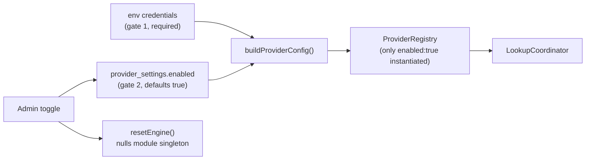

# Harmony Engine Admin Console: Gaps and Expansion

## Part 1 — What exists today

Provider control lives at `/admin/harmony` and is a two-gate system:



Key files: [apps/web/src/lib/harmonization.ts](apps/web/src/lib/harmonization.ts), [apps/web/src/app/(authenticated)/admin/harmony/actions.ts](<apps/web/src/app/(authenticated)/admin/harmony/actions.ts>), [apps/web/src/app/(authenticated)/admin/harmony/page.tsx](<apps/web/src/app/(authenticated)/admin/harmony/page.tsx>), [apps/web/src/app/(authenticated)/admin/harmony/provider-metadata.ts](<apps/web/src/app/(authenticated)/admin/harmony/provider-metadata.ts>), [packages/harmony-engine/src/providers/index.ts](packages/harmony-engine/src/providers/index.ts), [packages/harmony-engine/src/providers/base.provider.ts](packages/harmony-engine/src/providers/base.provider.ts).

Implemented adapters: MusicBrainz, Spotify, Tidal, Apple Music. Discogs/Last.fm/Deezer/SoundCloud exist only as spec text or UI badges.

## Part 2 — Enable/disable gaps (ranked)

- **G1 (correctness, high). `resetEngine()` is process-local.** `engine` is a module singleton; `resetEngine()` sets it to `null` only in the instance that ran the server action. Other warm Fluid Compute instances keep the stale provider set until recycled, so a disable is non-deterministic in production. Fix: cache the settings fingerprint with `unstable_cache` + a `cacheTag`, call `updateTag` on write, and have `getHarmonizationEngine()` rebuild when the fingerprint changes. A short TTL (5-10s) fallback covers direct DB edits.
- **G2 (safety, high). Nothing prevents disabling every provider.** All four can be toggled off; engine reports Offline and public release/track/artist pages plus `/api/v1/*` search silently return nothing. MusicBrainz is the only credential-free fallback and is treated like any other toggle. Fix: block the last-enabled-provider disable server-side, and add a destructive-action confirm dialog with impact copy.
- **G3 (UX, high). Disabled breaks user-scoped features with a wrong error.** `getFollowedArtistsFromProvider` / `getPlaylistsFromProvider` / `getRecentlyPlayedFromProvider` call `engine.getProvider(name)`, get `undefined` for a disabled provider, then fall through to `throw new Error("Provider 'x' does not support followed artists")`. `searchArtistsWithUserProvider` silently degrades to MusicBrainz. Fix: distinguish "not supported" from "disabled" with a dedicated error, and show connected-account counts in the disable confirm ("Spotify is connected by 42 users").
- **G4 (UX, medium). Credentials-missing is indistinguishable from admin-disabled.** `isToggledOn = hasCredentials && setting.enabled`, so pulling `SPOTIFY_CLIENT_SECRET` renders the same off+disabled state as a deliberate toggle-off. Fix: a third `Credentials missing` badge state listing the exact env vars required.
- **G5 (correctness, medium). Priority UI copy is wrong.** The card says providers are "queried highest-priority first, and the first match wins". True only for track-by-ISRC. Release-by-GTIN/URL runs `Promise.allSettled` across all providers and `ReleaseMerger.merge()` sorts by `confidence`, ignoring priority entirely; search flat-maps in priority order. Fix: correct the copy per lookup type, and optionally make `ReleaseMerger` priority-aware as a tiebreak.
- **G6 (ops, medium). No audit trail.** `ProviderSetting` has `updatedAt` but no `updatedBy`. Add `updatedByUserId` and a small change-log surface.
- **G7 (correctness, medium). Capability badges are fake.** In [apps/web/src/app/(authenticated)/admin/actions.ts](<apps/web/src/app/(authenticated)/admin/actions.ts>), `releaseLookup`/`trackLookup`/`artistLookup`/`search` are hardcoded `true`; only `userAuth` reads `p.supportsUserAuth`. Playlists and recently-played, which genuinely differ per provider, are not shown at all.
- **G8 (ops, low). `SnapshotCache` is dead code in web.** `getHarmonizationEngine()` passes `redis: null`, so the Redis snapshot cache and the Redis sliding-window rate limiter never run. Also nothing purges cache on a provider change.
- **G9 (tests, low). No coverage** for `buildProviderConfig`, `updateProviderEnabled`, or the credential gate. Existing tests only cover engine providers and URL parsing.

## Part 3 — The unlock: an engine-owned provider manifest

Today the admin console hardcodes provider knowledge in three places that must stay in sync: `SUPPORTED_PROVIDERS` in the actions file, `PROVIDER_METADATA` in the metadata file, and `ProviderName` in the registry. Adding a fifth adapter means editing all three.

Instead, have each provider class declare a static manifest in `packages/harmony-engine`:

```ts
export interface ProviderManifest {
  name: string;
  displayName: string;
  authType: 'none' | 'client_credentials' | 'developer_token';
  defaultPriority: number;
  requiredCredentials: readonly string[]; // env var names
  optionalCredentials?: readonly string[];
  capabilities: readonly ProviderCapability[];
}

export type ProviderCapability =
  | 'release_lookup'
  | 'track_lookup'
  | 'artist_lookup'
  | 'search'
  | 'url_resolve'
  | 'user_profile'
  | 'followed_artists'
  | 'playlists'
  | 'recently_played';
```

Export `PROVIDER_MANIFESTS` from the registry. The admin page then renders from the manifest, `getProvidersWithCredentials()` derives from `requiredCredentials` instead of hand-written `if` chains, and validation replaces `SUPPORTED_PROVIDERS`. **Adding a new provider becomes: write the adapter, declare the manifest — it appears in admin automatically.** This is the honest version of "a UI for adding a new provider"; a no-code generic provider form is not viable because every adapter has bespoke auth, response mapping, and URL parsing.

## Part 4 — Per-feature toggles

With real capabilities from the manifest, add a JSON column rather than a new table:

```prisma
model ProviderSetting {
  // ...existing
  disabledFeatures Json @default("[]") @map("disabled_features")
  updatedByUserId  String? @map("updated_by_user_id")
}
```

Enforcement belongs in `BaseProvider`: the existing public wrappers already funnel through `withRateLimitAndRetry()`, so add a `assertFeatureEnabled(capability)` check there that throws a new `FeatureDisabledError`. The UI becomes a per-provider expandable row of switches, greyed out for capabilities the adapter does not declare.

## Part 5 — Other short-reach wins already supported by the engine

These are config knobs `ProviderConfig` already accepts but that `buildProviderConfig()` hardcodes; each is a low-risk admin field backed by new `ProviderSetting` columns:

- `rateLimit.requests` / `rateLimit.windowMs` — currently 1/1000ms for MusicBrainz, 10/1000ms elsewhere.
- `cache.ttlSeconds` and `cache.staleWhileRevalidateSeconds`.
- `retry.retries` / `minTimeout` / `maxTimeout` / `factor`.
- Non-secret provider settings safe to edit in UI: `TIDAL_COUNTRY_CODE`, `APPLE_MUSIC_STOREFRONT`, `MUSICBRAINZ_CONTACT`.
- **Live connection test** per provider: a server action that runs a known-good lookup through one provider and reports latency plus error — turns the fake capability badges into measured ones and gives `/admin/status` a real per-provider health probe instead of just counting enabled providers.
- **URL router tester**: `registry.findByUrl()` / `canHandleUrl()` / `parseUrl()` already exist; a paste-a-URL box showing which provider claims it is nearly free.

Credential entry in the UI (writing secrets to the DB rather than env) is deliberately excluded — it needs an encryption-at-rest decision and should be its own scoped piece of work.

## Decision needed

Tier 1 (gaps G1-G5, G9) is self-contained and should land first regardless. Tier 2 (manifest, G7, connection test) is the enabler. Tier 3 (per-feature toggles, tuning knobs) depends on Tier 2. Confirm whether to implement all three tiers in sequence or stop after Tier 1 and review.
