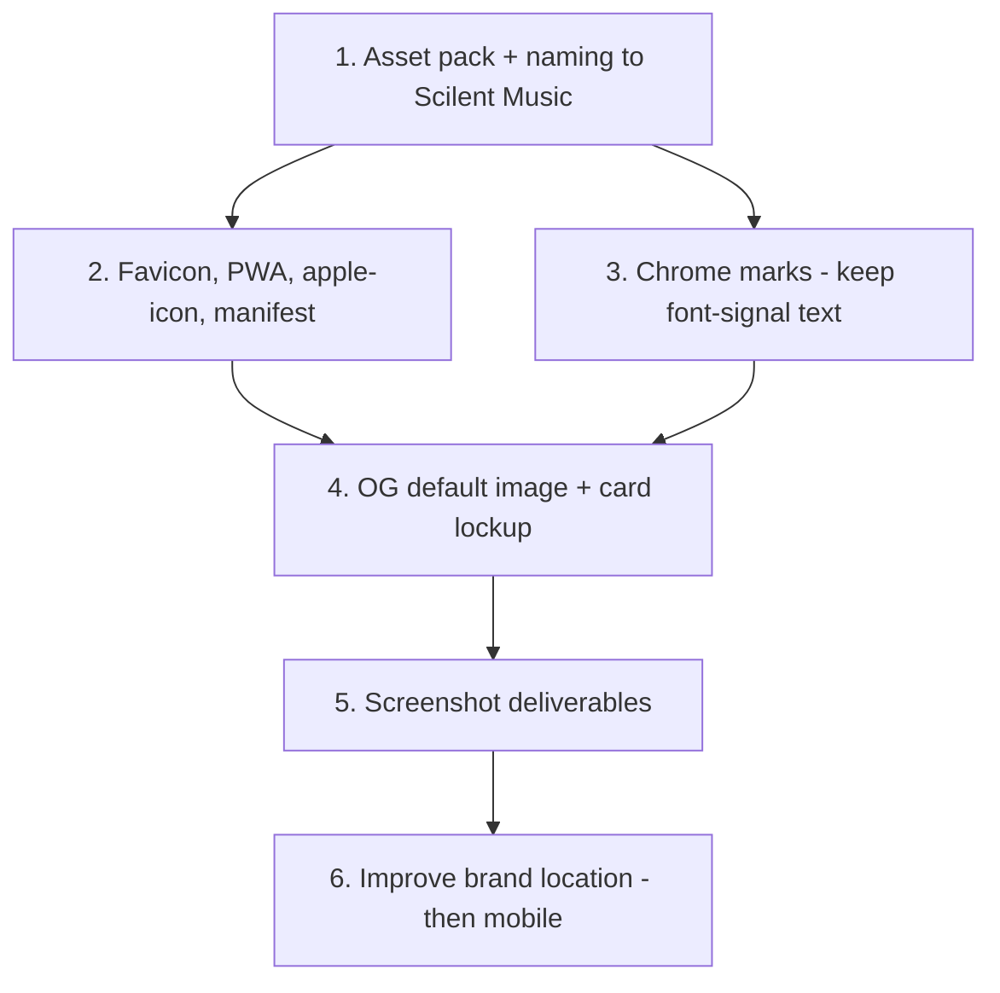

# Logo audit and implementation

There is no Scilent logo in this repo. Every brand surface is currently a placeholder, and the
placeholders are inconsistent with each other. This plan is the audit plus the rollout.

**Current shipped state:** Marquee landing was reverted (PR #273). `/` is again the
hero-only client landing with `SpotlightWordmark` (Doto) and `SHOW_BELOW_FOLD = false`.
Doto exceptions in [`docs/BRAND.md`](../../docs/BRAND.md) §4 are `SpotlightWordmark` +
`SidebarLogo`. #258 remains the re-land path. Tables below that name a landing
`SpotlightWordmark` match current shipped state again.

Note the one genuinely branded thing already in the monorepo is _other people's_ logos —
Spotify, Apple Music, and Tidal icons under
[`packages/scilent-ui/src/icons/`](../../packages/scilent-ui/src/icons/) with a well-built
variant/color/size API. That is the pattern to copy for Scilent's own mark, not something to
replace.

## Decisions (locked)

| Decision                      | Choice                                                                                                                                                                          |
| ----------------------------- | ------------------------------------------------------------------------------------------------------------------------------------------------------------------------------- |
| Web product name              | **Scilent Music**                                                                                                                                                               |
| Repo / package / domain names | **Do not change** — GitHub repo stays `scilent-x`, packages stay `@scilent-one/*`, domain stays `scilentmusic.com`                                                              |
| Landing + sidebar wordmarks   | **Keep** the existing Doto `font-signal` text wordmarks — do not replace with an SVG wordmark in this pass. Token mapping changed in the brand-system rollout (see note below). |
| Asset home (web)              | **`apps/web/public/brand/`** + `apps/web/src/components/scilent-logo.tsx`                                                                                                       |
| Mobile logos                  | **Blocked** until brand asset location is improved beyond web-only `public/brand/` (see [Mobile prerequisite](#mobile-prerequisite-before-expo-icons))                          |

## Audit: what is a placeholder today

### Icons and favicons

| Surface               | Current                                                                                            | Evidence                                                                                         |
| --------------------- | -------------------------------------------------------------------------------------------------- | ------------------------------------------------------------------------------------------------ |
| Browser favicon       | Generated 32x32 dark square with the letter **"S"**                                                | [`apps/web/src/app/icon.tsx`](../../apps/web/src/app/icon.tsx)                                   |
| PWA icons (192, 512)  | Same generated **"S"**, scaled                                                                     | [`apps/web/src/app/pwa-icon/[size]/route.tsx`](../../apps/web/src/app/pwa-icon/[size]/route.tsx) |
| Apple touch icon      | **Missing** — no `apple-icon` file                                                                 | —                                                                                                |
| Manifest icon entries | Point at the generated routes; 512 is marked `purpose: 'maskable'` with no safe-zone consideration | [`apps/web/src/app/manifest.ts`](../../apps/web/src/app/manifest.ts)                             |

The generated icon is literally this:

```tsx
// apps/web/src/app/icon.tsx
background: '#0a0a0a',
color: '#f5f5f5',
fontSize: 18,
fontWeight: 700,
// ...
S
```

### In-app chrome

| Surface                         | Current                                                                                     | This plan                                                                                                                          |
| ------------------------------- | ------------------------------------------------------------------------------------------- | ---------------------------------------------------------------------------------------------------------------------------------- |
| Sidebar                         | Lucide **`Music2`** + `font-signal` "scilentmusic" (Doto exception in `docs/BRAND.md`)      | Replace **mark only** (`Music2` → logo mark). **Keep** the Doto text.                                                              |
| Public / unauthenticated header | Brand link **commented out**                                                                | Restore brand link: mark + existing text (same treatment as sidebar). Highest leverage — `(public)` share pages reuse this header. |
| Landing page                    | `font-signal` "scilent.music" hero (`SpotlightWordmark`; Doto exception in `docs/BRAND.md`) | **Keep as-is.** Do not replace with an SVG wordmark.                                                                               |
| Login / signup cards            | Title only, no mark                                                                         | Add mark above the card title.                                                                                                     |

Display font wiring (current after brand-system alignment; see [`docs/BRAND.md`](../../docs/BRAND.md) §4):

- [`apps/web/src/lib/fonts.ts`](../../apps/web/src/lib/fonts.ts) loads Doto, Space Grotesk, Source Sans 3, Space Mono
- `--font-display` / `font-display` is **Space Grotesk** (headings, not the chrome wordmarks)
- `--font-signal` / `font-signal` is **Doto**, numerals-only except the landing hero `SpotlightWordmark` and the sidebar `SidebarLogo` (both documented in `docs/BRAND.md` §4)
- There is no user-facing palette picker anymore — screenshot checks are light/dark only

### Share cards

No `opengraph-image`, no `twitter-image`, and no `og:image` in root metadata — see
[`og_share_enhancements`](./og_share_enhancements_b4d1f9a2.plan.md), which owns the card work and
needs the lockup this plan produces.

### Mobile (deferred)

[`apps/mobile/app.json`](../../apps/mobile/app.json) sets **no** `icon`, no
`android.adaptiveIcon`, and no splash `image` — only a background color. Expo falls back to its
defaults. Mobile display name is already `Scilent Music` (aligned). Icon/splash work is **not** in
this implementation pass — see [Mobile prerequisite](#mobile-prerequisite-before-expo-icons).

### Leftover starter assets

[`apps/web/public/`](../../apps/web/public/) still contains `next.svg`, `vercel.svg`, `file.svg`,
`globe.svg`, and `window.svg` from `create-next-app`. Delete these while adding the brand folder —
grep first to confirm nothing references them.

## Naming: apply "Scilent Music" (`logo-naming`)

**Decided:** the web app's user-facing product name is **Scilent Music**.

Update strings where the product is named to users or crawlers. Do **not** rename the repository,
npm scopes, or domain.

| Change                                            | File(s)                                                                                         | From → To                                                                                                            |
| ------------------------------------------------- | ----------------------------------------------------------------------------------------------- | -------------------------------------------------------------------------------------------------------------------- |
| Document title / template                         | [`layout.tsx`](../../apps/web/src/app/layout.tsx)                                               | `Scilent X` → `Scilent Music`                                                                                        |
| Meta description / OG / Twitter                   | same                                                                                            | "Scilent X is a…" → "Scilent Music is a…"                                                                            |
| `openGraph.siteName`                              | same                                                                                            | `Scilent X` → `Scilent Music`                                                                                        |
| PWA `name`                                        | [`manifest.ts`](../../apps/web/src/app/manifest.ts)                                             | `Scilent X` → `Scilent Music`                                                                                        |
| PWA `short_name`                                  | same                                                                                            | Keep short form — prefer `Scilent` (home-screen label length) unless a mark-only icon makes a longer short_name fine |
| Share sheet titles                                | [`post-detail-page-client.tsx`](../../apps/web/src/components/post-detail-page-client.tsx) etc. | `"… on Scilent"` → `"… on Scilent Music"` where product name is intended                                             |
| Product docs that say "Scilent X" as the app name | e.g. [`docs/SHARING.md`](../../docs/SHARING.md) unfurl troubleshooting                          | Align wording to Scilent Music                                                                                       |

**Leave alone (not product-name UI, or explicitly preserved):**

- GitHub repository name `scilent-x` / README `# Scilent X` as the repo title (repo rename is a
  separate, deliberate action — **out of scope**)
- Package names `@scilent-one/*`
- Domain / env examples (`scilentmusic.com`, `beta.scilentmusic.com`)
- Sidebar display text `scilentmusic` and landing `scilent music` — stylized wordmarks kept as-is
  for this pass
- Bundle IDs / URL schemes (`music.scilent.app`, `scilent://`)
- Expo `name` (already `Scilent Music`)

The OG plan's overlapping naming todo should reference this decision rather than reopening it.

## Asset pack to produce (`logo-assets`)

| Asset            | Size / format                                       | Consumed by                                                                                 |
| ---------------- | --------------------------------------------------- | ------------------------------------------------------------------------------------------- |
| Mark, master     | SVG source + 1024x1024 PNG                          | Source of truth for everything below                                                        |
| Favicon          | 32x32 PNG (and/or SVG)                              | `app/icon.tsx` replacement                                                                  |
| Apple touch icon | 180x180 PNG                                         | New `app/apple-icon` — Safari home screen                                                   |
| PWA "any"        | 192x192 PNG                                         | `manifest.ts` install icon, task switcher                                                   |
| PWA "maskable"   | 512x512 PNG, mark inside a ~80% safe zone           | Android adaptive icon — a full-bleed mark gets cropped into a circle                        |
| Default OG card  | 1200x630 PNG/JPG                                    | Root `opengraph-image` / `twitter-image`                                                    |
| Overlay mark     | Transparent PNG/SVG                                 | Corner lockup on composed OG cards                                                          |
| Mark only, small | SVG optimized for ~24-32px, `currentColor`-friendly | Sidebar square, nav, auth headers                                                           |
| Wordmark SVG     | Optional / later                                    | **Not required this pass** — landing and sidebar keep the Doto `font-signal` text wordmarks |

Mobile-specific assets (Expo icon, adaptive foreground, splash) stay on the asset checklist for when
the [mobile prerequisite](#mobile-prerequisite-before-expo-icons) is done — do not block web
delivery on producing them first if that slows the web pass, but prefer generating the 1024 master
once so mobile can reuse it later.

Light/dark: the sidebar, auth cards, and landing all sit on themed backgrounds, and dark is the
app's default (`#0a0a0a`). Prefer a single-color mark driven by `currentColor` (same pattern as
`AppleMusicIcon`'s `color: 'auto'`), and keep a full-color variant for the OG card and eventual
store icons where the background is fixed.

Run everything through SVGO (`npx svgo --precision=1 --multipass`) before committing.

## Where assets live (`logo-location`)

**Decided for web:** `apps/web/public/brand/` plus
`apps/web/src/components/scilent-logo.tsx` exposing at least a `mark` variant (and later
`lockup` if needed for OG).

That keeps this pass a single-app change, but user-facing `apps/web` work now needs a `web`
changeset; `packages/scilent-ui` only needs one if its shared contract changes.

Provider icons today live in both `packages/scilent-ui` and `apps/web/public/` — that duplication is
the cautionary tale. Starting web-only is fine **only if** we do not pretend it is the long-term
home for mobile.

### Mobile prerequisite (before Expo icons)

**Explicit gate:** do **not** implement logos in `apps/mobile` while the only source of truth is
`apps/web/public/brand/`. Expo cannot import from the web app's `public/` folder, and copying PNGs
into `apps/mobile/assets/` by hand would create a third copy with no ownership story.

Before `logo-mobile` (or any Expo `icon` / splash / adaptiveIcon work) lands, improve the brand
asset location so web and mobile share one source of truth. Candidates (pick one in a follow-up):

1. Promote to `packages/scilent-ui` (or a small `@scilent-one/brand` package) with a changeset, and
   have web + mobile consume from there
2. A dedicated `packages/brand` (or `assets/brand`) package that only holds static logos, consumed
   by both apps
3. Documented export/sync step if a true shared package is premature — last resort

Until that improvement ships, mobile remains on Expo defaults. Tracked as
`logo-mobile-prerequisite` (blocked / pending), not as an implementation todo in this web pass.

## Rollout order



1. **Assets + naming** (`logo-assets`, `logo-location`, `logo-naming`) — blocks everything else.
2. **Icons** (`logo-icons`) — highest visibility per unit of work. Replace the generated `"S"`
   routes with static files (simpler than `ImageResponse` once real art exists), add `apple-icon`,
   and update `manifest.ts`. Note
   [`apps/web/src/lib/__tests__/share-target.test.ts`](../../apps/web/src/lib/__tests__/share-target.test.ts)
   asserts the manifest's exact icon `src` values (`/pwa-icon/192.png`, `/pwa-icon/512.png`) and
   will need updating if the paths change.
3. **Chrome** (`logo-chrome`) — mark only beside preserved `font-signal` wordmarks; restore nav
   brand link; mark on auth cards. Do **not** replace landing or sidebar text with an SVG wordmark.
4. **OG** (`logo-og`) — hand the lockup to the card generator in the OG plan.
5. **Screenshots** (`logo-screenshots`) — required deliverable for the implementing PR (below).
6. **Mobile** — only after `logo-mobile-prerequisite` (shared brand location) is done.

## Screenshot / visual deliverables (`logo-screenshots`)

The implementing PR must include visuals of the added logos/icons in context — not just a file
listing. Capture and attach (PR description images / `/opt/cursor/artifacts` walkthrough, or
equivalent):

| #   | Shot                            | What to show                                                                  |
| --- | ------------------------------- | ----------------------------------------------------------------------------- |
| 1   | Browser tab                     | Favicon at normal tab size (light and dark OS chrome if possible)             |
| 2   | PWA / home screen               | 192 and/or installed icon; maskable 512 under a circular crop check           |
| 3   | Sidebar                         | Mark + existing Doto `font-signal` "scilentmusic" — light and dark            |
| 4   | Public header                   | Restored brand link on a `(public)` page (e.g. a track or release share page) |
| 5   | Landing                         | Unchanged Doto `font-signal` hero still looks correct next to any new chrome  |
| 6   | Login (and signup if different) | Mark above the card                                                           |
| 7   | Default OG card                 | The 1200x630 image (open `/opengraph-image` or the generated file)            |

If the OG plan's composed entity card lands in the same timeframe, include one entity unfurl preview
as a bonus shot; otherwise the default OG card is enough for this plan's scope.

## Verification (`logo-verify`)

```bash
pnpm --filter web build
pnpm --filter web test:run
pnpm lint
```

Plus:

- [ ] Grep user-facing web strings for leftover `Scilent X` (allow repo README / historical docs /
      package names as noted above)
- [ ] Favicon renders crisply in a browser tab at 16px effective size
- [ ] Install the PWA on iOS and Android — home screen icon is the mark, not a screenshot or letter
- [ ] Android adaptive icon is not cropped (check the maskable safe zone with a circular mask)
- [ ] Sidebar + auth cards legible in light/dark; landing hero text untouched
- [ ] Shared link default OG shows the branded card (needs a deploy; see the OG plan's checklist)
- [ ] `apps/web/public` no longer contains `next.svg` / `vercel.svg` / `file.svg` / `globe.svg` /
      `window.svg`
- [ ] Screenshot deliverables attached to the implementing PR

## Out of scope

- Renaming the GitHub repository (`scilent-x`)
- Replacing landing or sidebar `font-signal` wordmarks with SVG wordmarks
- Implementing Expo icon / adaptive icon / splash **before** the brand-location prerequisite
- App Store / Play Store listing artwork (screenshots, feature graphics) — store submission work
- Email templates: there are none in the repo yet
- Storybook branding for `packages/ui` / `packages/scilent-ui` — cosmetic, no user impact
- A full design system or brand guidelines document
