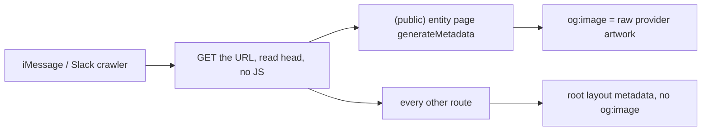

# OG + share sheet enhancements

How link previews work today is documented in [`docs/SHARING.md`](../../docs/SHARING.md) under
"How OG previews work". This plan is the polish pass on top of that: v1 proved the plumbing
(public routes + `generateMetadata` + real artwork), and this makes the result look deliberate.

Related plans:

- [`logo_audit_implementation`](./logo_audit_implementation_f2b6c04e.plan.md) owns **product naming**
  (**Scilent Music** for the web app) and **logo / brand assets** (mark, favicon, PWA icons,
  `apps/web/public/brand/`). This OG plan consumes those — it does not decide naming or ship logo
  assets.
- [`public_review_details_page`](./public_review_details_page_c8e3a7d1.plan.md) consumes the card
  generator from this plan for review unfurls.

## Where we are



| Surface                                                                  | Today                                                                                                                                                                                        |
| ------------------------------------------------------------------------ | -------------------------------------------------------------------------------------------------------------------------------------------------------------------------------------------- |
| `/tracks/{isrc}`, `/releases/{gtin}`, `/artists/{mbid}`                  | Per-page `generateMetadata` with real title/description + raw provider artwork                                                                                                               |
| Everything else (`/`, `/login`, `/signup`, `/review/{id}`, `/post/{id}`) | Generic root metadata from [`apps/web/src/app/layout.tsx`](../../apps/web/src/app/layout.tsx) — **no `og:image` anywhere**                                                                   |
| `twitter` tags                                                           | `card` is set per page, but `images` is never re-listed                                                                                                                                      |
| Native share sheet                                                       | `title`/`text` passed ad hoc per [`ShareButton`](../../apps/web/src/components/share-button.tsx) call site                                                                                   |
| Brand imagery                                                            | None. The only generated images are the placeholder "S" in [`icon.tsx`](../../apps/web/src/app/icon.tsx) and [`pwa-icon/[size]/route.tsx`](../../apps/web/src/app/pwa-icon/[size]/route.tsx) |

Two consequences worth naming, because they are the actual user-visible problems:

1. **A shared home/login/review link unfurls as text.** No image, generic description. That is the
   worst-looking case and it is the most likely link a new user receives.
2. **Entity links unfurl as bare cover art.** Correct, but indistinguishable from a Spotify or
   Apple link — nothing says Scilent, and there is no room for the review/artist context.

## What changes

### 1. Default OG image (`og-default-image`)

Add colocated route-level images at the app root, which Next.js picks up automatically and
inherits down the tree:

- `apps/web/src/app/opengraph-image.tsx` — `ImageResponse`, `size = { width: 1200, height: 630 }`,
  `contentType = 'image/png'`
- `apps/web/src/app/twitter-image.tsx` — re-export the same renderer so the two never drift

Follow the existing `ImageResponse` shape already in the repo:

```ts
// apps/web/src/app/icon.tsx (existing pattern to mirror)
import { ImageResponse } from 'next/og';

export const size = { width: 32, height: 32 };
export const contentType = 'image/png';
```

Content: brand lockup on the app's dark background (`#0a0a0a`, matching
[`manifest.ts`](../../apps/web/src/app/manifest.ts)'s `background_color`/`theme_color`) plus the
product one-liner. Once colocated files exist, remove the now-redundant hand-written
`openGraph`/`twitter` title+description duplication in `layout.tsx` only if it stays readable —
the file currently repeats the same description string three times.

**Depends on the logo plan for the mark.** Until
[`logo_audit_implementation`](./logo_audit_implementation_f2b6c04e.plan.md) lands real assets under
`apps/web/public/brand/`, render the product name as text ("Scilent Music" — naming decided there)
so this plan is not blocked. Swap in the mark when available; do not invent a parallel logo here.

### 2. Shared branded card generator (`og-card-generator`)

One renderer, used by every dynamic unfurl, so cards are a family rather than per-page one-offs.

- `apps/web/src/lib/og.tsx` — a `renderOgCard({ title, subtitle, eyebrow, imageUrl })` helper
  returning the JSX for an `ImageResponse`, plus the shared `size`/`contentType` constants.
- `apps/web/src/app/api/og/route.tsx` — a single dynamic route taking signed-or-validated search
  params (`title`, `subtitle`, `eyebrow`, `image`) and returning the composed PNG.

Layout: artwork square bleeding off one edge, title + subtitle stacked, small brand lockup in a
corner, dark background. `eyebrow` carries the content type ("Album", "Track", "Review by
@user") so one renderer covers all surfaces.

Two design decisions to settle while implementing:

- **Param validation.** The route fetches a remote `image` URL, so restrict it to the artwork
  hosts the harmony engine actually returns (Spotify CDN, Apple, Cover Art Archive) rather than
  proxying arbitrary URLs. An allowlist is simpler than signing and is enough here.
- **Caching.** Add explicit `Cache-Control` headers; these images are deterministic per param set
  and crawlers refetch them often.

Fonts: `ImageResponse` does not inherit the app's next/font setup. Either load a font file
explicitly in the renderer or accept the default sans — decide once, in `og.tsx`, so all cards
match.

### 3. Entity page metadata (`og-entity-pages`)

For each of [`(public)/tracks/[isrc]`](<../../apps/web/src/app/(public)/tracks/[isrc]/page.tsx>),
[`(public)/releases/[gtin]`](<../../apps/web/src/app/(public)/releases/[gtin]/page.tsx>), and
[`(public)/artists/[mbid]`](<../../apps/web/src/app/(public)/artists/[mbid]/page.tsx>):

- Swap `openGraph.images` from the raw artwork URL to the composed card URL.
- Add `twitter.images` — currently only `card` is set, so platforms fall back to `og:image`. That
  usually works but leaves the behavior implicit.
- Copy pass on `title`/`description`. Current strings are serviceable but templated:

```ts
// apps/web/src/app/(public)/tracks/[isrc]/page.tsx (today)
const title = `${track.title} — ${artistLabel}`;
const description = `Listen to and review "${track.title}" by ${artistLabel} on Scilent.`;
```

Tracks and releases share that phrasing verbatim; artists say "Follow {name} and see reviews of
their music on Scilent." Decide whether descriptions should describe the entity or invite the
action, and apply consistently. When copy mentions the product, use **Scilent Music** (decided in
the logo plan) — do not reopen the naming debate here. Broader renames of `layout.tsx` /
`manifest.ts` / in-app chrome are **out of scope for this plan** and live in
[`logo_audit_implementation`](./logo_audit_implementation_f2b6c04e.plan.md).

### 4. Artwork fallback rule (`og-artwork-fallback`)

Every page currently spreads images conditionally:

```ts
...(artworkUrl ? { images: [{ url: artworkUrl }] } : {}),
```

So a release with no artwork emits no `og:image` and inherits nothing useful. Once the root
`opengraph-image.tsx` exists, colocated inheritance covers the no-image case automatically — but
only if the page stops setting an empty `openGraph`. Verify the built HTML for an artwork-less
entity actually carries the default image, and if inheritance does not apply the way the docs
imply, fall back explicitly to the default card URL.

### 5. Share sheet copy (`og-share-sheet-copy`)

Distinct from crawler tags: `navigator.share({ title, url, text })` is what the OS sheet and the
recipient's message body show. Call sites today:

| Call site                                                                                  | Current `title` / `text`                      |
| ------------------------------------------------------------------------------------------ | --------------------------------------------- |
| [`(public)/tracks/[isrc]`](<../../apps/web/src/app/(public)/tracks/[isrc]/page.tsx>)       | `track.title` / `"{title} — {artist}"`        |
| [`(public)/releases/[gtin]`](<../../apps/web/src/app/(public)/releases/[gtin]/page.tsx>)   | `release.title` / `"{title} — {artist}"`      |
| [`(public)/artists/[mbid]`](<../../apps/web/src/app/(public)/artists/[mbid]/page.tsx>)     | `artist.name`, no `text`                      |
| [`post-detail-page-client.tsx`](../../apps/web/src/components/post-detail-page-client.tsx) | `` `${entityLabel} on Scilent`  ``, no `text` |

Make these consistent, and give the artist and review cases a `text`. Product mentions in share
copy should say **Scilent Music** per the logo plan (e.g. `"Review on Scilent Music"`), but the
global naming pass across metadata/manifest/chrome is not this plan's job.

Also worth confirming: the entity context menus' **Copy Link** in
[`harmony-interaction-provider.tsx`](../../apps/web/src/components/harmony-interaction-provider.tsx)
is clipboard-only by design — leave it, but confirm it still produces the same canonical URL the
Share button does (both go through [`canonical-urls.ts`](../../apps/web/src/lib/canonical-urls.ts),
so this is a regression check, not a change).

### 6. Verification (`og-verify`)

Automated:

```bash
pnpm --filter web build
pnpm --filter web typecheck
pnpm --filter web lint
pnpm --filter web test:run
```

Add a unit test asserting `generateMetadata` for a resolved entity returns both `openGraph.images`
and `twitter.images` pointing at the card route — cheap, and it locks in the parity that is easy
to lose. Hitting `/api/og?...` in a dev server and eyeballing the PNG is the fastest visual check.

Human-only (agents cannot do this from a sandbox — same caveat as `docs/SHARING.md`'s
"What you need to do"):

- [ ] Paste a track, release, artist, and home URL into iMessage — each shows a branded card
- [ ] Same four in Slack
- [ ] Re-check a previously-shared URL after deploying; unfurl caches are sticky, so use the
      [Facebook Sharing Debugger](https://developers.facebook.com/tools/debug/) to force a refetch
      and confirm the exact tags a crawler receives (crawlers do not run JS, so this is ground
      truth, not what your browser renders)
- [ ] Tap Share on a phone and confirm the sheet's title/text read well in the composed message

Update `docs/SHARING.md`'s "How OG previews work" section once the card generator exists — that
doc is the maintained reference, this plan is just scope.

## Out of scope

- **Product naming and logo assets** — owned by
  [`logo_audit_implementation`](./logo_audit_implementation_f2b6c04e.plan.md) (web name
  **Scilent Music**, mark/favicon/PWA/`public/brand/`, display-font wordmarks kept on landing and
  sidebar). This plan only consumes those decisions/assets for OG cards and share-sheet copy that
  happens to mention the product.
- Public `/review/{id}` routes — separate plan, though it consumes the card generator here.
  `/post/{id}` stays authenticated for now (also deferred in that plan).
- Profile sharing (`/profile/{username}`): no canonical path helper exists yet and it is
  deliberately deferred.
- v2 DM rich cards and v3 open-in-provider deep links — see the sharing ladder plan.
