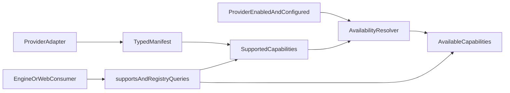

# Provider Capability Manifests

## Goals and boundaries

- Model every provider operation as a stable typed capability rather than inferring support from methods or hardcoded web maps.
- Keep two distinct concepts: `supported` capabilities declared by an adapter and `available` capabilities after provider enablement and credential/configuration gates.
- Scope policy globally per provider. This phase does not add per-user, tenant, regional, or database-backed per-capability toggles.
- Preserve existing API routes, helper signatures, response shapes, and provider-specific methods during the cutover.

## Capability contract

- Add capability IDs and descriptors in [packages/harmony-engine/src/types/provider.types.ts](packages/harmony-engine/src/types/provider.types.ts). Use exact operation-level IDs for catalog lookup, search, account, and library operations; each descriptor records its access requirement as `none`, `appCredential`, or `userToken`.
- Add a typed immutable manifest to [packages/harmony-engine/src/providers/base.provider.ts](packages/harmony-engine/src/providers/base.provider.ts), plus `supports(capability)` and common optional methods for operations currently exposed only by concrete providers.
- Normalize user-token artist search into the shared provider contract while retaining `searchArtistsWithUserToken` on Spotify and Tidal as deprecated compatibility aliases.
- Add dedicated unsupported-capability and invalid-manifest errors in [packages/harmony-engine/src/errors/index.ts](packages/harmony-engine/src/errors/index.ts).

## Provider declarations and validation

- Declare truthful manifests in each built-in adapter: [musicbrainz.provider.ts](packages/harmony-engine/src/providers/musicbrainz.provider.ts), [spotify.provider.ts](packages/harmony-engine/src/providers/spotify.provider.ts), [tidal.provider.ts](packages/harmony-engine/src/providers/tidal.provider.ts), and [apple-music.provider.ts](packages/harmony-engine/src/providers/apple-music.provider.ts).
- Extend [packages/harmony-engine/src/providers/index.ts](packages/harmony-engine/src/providers/index.ts) with registry queries for manifests, supported operations, available operations, and providers supporting an operation.
- Validate manifests when providers register. Reject duplicate capabilities, invalid descriptors, and capabilities whose shared method remains the base unsupported implementation. Coordinators must skip incapable providers; direct unsupported calls must fail with the dedicated error.
- Keep the existing whole-provider `enabled` behavior unchanged and expose manifests independently so disabled/unconfigured providers remain discoverable as supported but not available.

## Web app cutover

- Refactor [apps/web/src/lib/harmonization.ts](apps/web/src/lib/harmonization.ts) to use common provider methods and capability checks instead of `instanceof`, while retaining its exported helper signatures and error/response contracts.
- Replace hardcoded `ProviderCapabilities` values in [apps/web/src/app/(authenticated)/admin/actions.ts](<apps/web/src/app/(authenticated)/admin/actions.ts>) with engine manifest data.
- Update [apps/web/src/app/(authenticated)/admin/harmony/page.tsx](<apps/web/src/app/(authenticated)/admin/harmony/page.tsx>) to consume truthful capabilities. Keep detailed operation data in the view model; group presentation into Catalog, Search, Account, and Library without prescribing final visual design.
- Keep provider credential detection and global database enablement in [apps/web/src/lib/harmonization.ts](apps/web/src/lib/harmonization.ts) as the source of current availability. Do not alter `ProviderSetting` yet.

## Compatibility and future policy seam

- Make the migration additive inside this private package: preserve current constructors, public helpers, route payloads, and concrete provider APIs.
- Document deprecated aliases and the distinction between supported, configured, enabled, and available in [agents/HARMONY_ENGINE_SPEC.md](agents/HARMONY_ENGINE_SPEC.md), correcting claims that conflict with the four implemented providers.
- Design manifest/availability APIs so a later global `enabledCapabilities` policy can be intersected without changing capability IDs or consumer calls:
  `available = supported ∩ providerEnabled ∩ configured ∩ policyEnabled`.
- Add the required package changeset under [.changeset](.changeset) describing the harmony-engine capability contract.

## README capability guide

- Rewrite [packages/harmony-engine/README.md](packages/harmony-engine/README.md) around a progressive explanation: why capabilities exist, how manifests declare support, and how `supported` differs from `available`.
- Include concise provider-manifest, `supports(capability)`, registry-discovery, and guarded-operation examples that developers can copy into adapters and consumers.
- Add a capability matrix for the four implemented providers, grouped by Catalog, Search, Account, and Library, generated or checked against the manifest declarations so the documentation cannot silently contradict the code.
- Explain the additive migration path, deprecated provider-specific aliases, access requirements (`none`, `appCredential`, and `userToken`), expected errors, and how to add a capability or provider safely.
- End with explicit next steps separated from current behavior: global `enabledCapabilities` policy, persistence/admin controls, runtime health, and eventual removal of deprecated aliases.

## Verification

- Extend [packages/harmony-engine/src/**tests**/providers.test.ts](packages/harmony-engine/src/__tests__/providers.test.ts) for each built-in manifest, `supports`, common user methods, deprecated aliases, registry filtering, and strict registration failures.
- Extend coordinator tests in [packages/harmony-engine/src/**tests**/coordinator.test.ts](packages/harmony-engine/src/__tests__/coordinator.test.ts) to prove unsupported providers are skipped and supported providers retain existing lookup behavior.
- Add focused web tests for capability-derived admin status and capability-driven helper dispatch, including disabled, unconfigured, unsupported, and user-token-required cases.
- Check README capability names and provider support claims against the manifest source of truth, using an automated documentation test or a generated matrix if practical.
- Run scoped harmony-engine and web tests, typechecks, and lint; then run the repository-level test/typecheck checks appropriate to the touched packages. Manually verify the admin harmony page reports distinct supported and available operations without changing existing API behavior.
