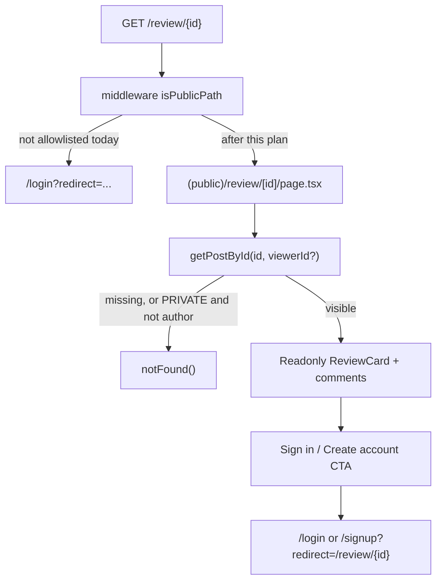

# Public review details page

This is the fast-follow already named in [`docs/SHARING.md`](../../docs/SHARING.md) under
"Known rough edges" and tracked as `v1-review-post-public` in
[`sharing_ladder_v0_v3`](./sharing_ladder_v0_v3_8f2a1c4d.plan.md):

> `/review/{id}` and `/post/{id}` still require login to view, even though they now have a Share
> button.

**Scope is reviews only.** `/post/{id}` stays authenticated for now (needs more product thinking)
and is listed under Out of scope. Profile sharing is also out of scope — there is no
`profilePath()` helper in [`canonical-urls.ts`](../../apps/web/src/lib/canonical-urls.ts) yet and
`/profile/[username]` stays authenticated.

## The problem, concretely

A user taps Share on a public review. The link is correct
(`absoluteUrl(reviewPath(id))`) and `ShareButton` already suppresses itself for private reviews:

```tsx
// apps/web/src/components/post-detail-page-client.tsx
const canShare = post.visibility !== 'PRIVATE';
const shareUrl = absoluteUrl(isReview ? reviewPath(id) : postPath(id));
```

But the recipient gets:

- **In the chat app:** a generic "Scilent X" text card. `/review/{id}` is not in `isPublicPath()`,
  so the crawler is 302'd to `/login` and never reads review metadata. There is no
  `generateMetadata` on the review route at all — the page is a client component.
- **On tap:** `/login?redirect=/review/{id}`. The link technically survives (post-login they land
  on the review), but a non-user hits a wall before seeing anything worth signing up for.

## Target flow



## Steps

### 1. Public server route (`review-public-route`)

Today [`(authenticated)/review/[id]/page.tsx`](<../../apps/web/src/app/(authenticated)/review/[id]/page.tsx>)
is a five-line client wrapper:

```tsx
'use client';
export default function ReviewPage({
  params,
}: {
  params: Promise<{ id: string }>;
}) {
  const { id } = use(params);
  return <PostDetailPageClient id={id} mode="review" />;
}
```

A client component cannot export `generateMetadata`, so the new route must be a **server**
component that loads the review itself. Add `apps/web/src/app/(public)/review/[id]/page.tsx`
following the shape of the existing public entity pages — a shared `resolveReview(id)` helper used
by both `generateMetadata` and the page body, exactly like `resolveTrack`/`resolveRelease` do, so
there is no second copy of the lookup logic to keep in sync.

Route groups do not affect the URL, so `(public)/review/[id]` and the existing authenticated route
cannot both claim `/review/{id}` — the authenticated one must move or be deleted. Decide alongside
step 7.

Do **not** add `(public)/post/[id]` in this pass.

### 2. Middleware allowlist (`review-middleware`)

Route groups only decide which layout renders. [`middleware.ts`](../../apps/web/src/middleware.ts)
runs first and redirects any cookie-less request whose path is not in `isPublicPath()`:

```ts
if (!isPublicPath(pathname)) {
  const sessionCookie = getSessionCookie(request);
  if (!sessionCookie) {
    /* redirect to /login */
  }
}
```

Add `/review/` only to the prefix list in
[`auth-guards.ts`](../../apps/web/src/lib/auth-guards.ts), next to the existing `/tracks/`,
`/releases/`, `/artists/` block. Do **not** allowlist `/post/`. Both the allowlist and the
`(public)` location are required — either alone still redirects. Extend
[`apps/web/src/lib/__tests__/auth-guards.test.ts`](../../apps/web/src/lib/__tests__/auth-guards.test.ts)
to cover `/review/` and assert `/post/` remains non-public.

### 3. Per-review metadata (`review-metadata`)

`generateMetadata` should produce a card that describes the review, not the app. The data is
already denormalized onto `ReviewSubject`, so no provider lookup is needed —
[`reviewSubjectSelect`](../../packages/social/src/posts/includes.ts) exposes `type`, `title`,
`artistLabel`, `artworkUrl`, `releaseDate`, `gtin`/`isrc`/`mbid`, and `snapshot`.

| Tag                    | Source                                                                                                                                                               |
| ---------------------- | -------------------------------------------------------------------------------------------------------------------------------------------------------------------- |
| `title`                | Author display name/username + subject, e.g. `"{name} reviewed {subject.title}"`                                                                                     |
| `description`          | Truncated review body (plain text, not `contentHtml`), with a sensible cap                                                                                           |
| `og:image`             | `reviewSubject.artworkUrl` fed through the branded card from [`og_share_enhancements`](./og_share_enhancements_b4d1f9a2.plan.md), with `eyebrow` = "Review by @user" |
| `twitter`              | `summary_large_image` plus the same `images`, mirroring the parity fix in that plan                                                                                  |
| `alternates.canonical` | `absoluteUrl(reviewPath(id))`                                                                                                                                        |
| `openGraph.type`       | `article`                                                                                                                                                            |
| `robots`               | **`{ index: false, follow: true }`** — decided. Reviews are shareable but not crawled. Leave reviews out of [`sitemap.ts`](../../apps/web/src/app/sitemap.ts).       |

Entity pages inherit the root `robots: { index: true }`; review pages must override that explicitly
in their `generateMetadata` return value so a crawler does not index user-generated content by
accident.

### 4. Privacy (`review-privacy`)

The data layer already does the right thing.
[`getPostById`](../../packages/social/src/posts/queries.ts) throws `NotFoundError` — not a 403 — so
private-post existence is not leaked:

```ts
// Don't leak the existence of a private post to non-authors.
if (post.visibility === 'PRIVATE' && post.authorId !== currentUserId) {
  throw new NotFoundError('Post');
}
```

What this plan must add is the same discipline on the **metadata** path. `generateMetadata` runs for
crawlers with no session, so it must return a minimal not-found metadata object (as the entity pages
do for unresolvable ids) rather than the review's title, description, or artwork. The page body
calls `notFound()`.

Tests to add:

- Anonymous request for a `PRIVATE` review renders not-found and its metadata carries no author,
  body text, or artwork
- Author request for their own `PRIVATE` review still renders
- Anonymous request for a `PUBLIC` review renders with full metadata

### 5. Readonly UI (`review-readonly-ui`)

[`PostDetailPageClient`](../../apps/web/src/components/post-detail-page-client.tsx) is built for a
signed-in author: it fetches `/api/v1/users/me`, wires like/unlike, repost, comment compose, inline
edit, delete, and the visibility toggle, and on a 404 does
`router.push('/reviews')` — an authenticated route, which would bounce an anonymous visitor
straight into a login redirect. Reusing it as-is for anonymous traffic is the wrong move.

Instead render a readonly view: `ReviewCard` with the subject preview, plus comments in read-only
form. Useful facts:

- `GET /api/v1/posts/:id/comments` already tolerates an anonymous caller
  (`getCommentsByPost(id, params, user?.id)`), so comments can be server-rendered or fetched
  without auth. `POST` on the same route 401s, which is the correct wall for compose.
- Anonymous visitors get no like/repost/edit/delete/visibility affordances at all — hidden, not
  disabled-and-confusing.
- Subject should link to the matching public entity page (`releasePath(gtin)` / `trackPath(isrc)`),
  which already exists and is public — a natural next hop for a new visitor.

Open question to settle while implementing: whether comments appear for anonymous visitors at all.
Default recommendation is yes, read-only — they are the social proof that makes signing up
attractive — but it is a product call, and hiding them is the more conservative privacy default.

### 6. Login / signup CTA (`review-cta`)

An inline card below the review (and where the comment composer would be) with:

- "Sign in to reply" → `/login?redirect=/review/{id}`
- "Create an account" → `/signup?redirect=/review/{id}`

Both forms already honor `?redirect=` — no new auth plumbing required for the happy path:

```ts
// apps/web/src/app/(unauthenticated)/signup/signup-form.tsx (and login-form.tsx, same shape)
const redirectTo =
  sanitizeInternalRedirect(searchParams.get('redirect')) ?? ROUTES.profile.href;
// used as callbackURL on email signup / social signup, and router.push onSuccess
```

The redirect target passes through
[`sanitizeInternalRedirect`](../../apps/web/src/lib/auth-guards.ts), which already accepts absolute
same-origin paths and rejects `//evil.com`. Build the CTA paths from `ROUTES.login` /
`ROUTES.signup` in [`routes.ts`](../../apps/web/src/lib/routes.ts) rather than hardcoding, and
append `?redirect=` via `URLSearchParams`.

Note the `(public)` layout already renders `AppNavMenu`, which gives logged-out visitors Sign in /
Sign up in the header and logged-in visitors "Open App" — so the CTA is contextual reinforcement in
the content column, not the only entry point. Header links currently do not carry a redirect (see
step 6b).

### 6b. Preserve redirect across login ↔ signup (`review-redirect-preserve`)

Checked: signup already reads and applies `redirect`. The real gap is the cross-links between the
two forms, which **drop** it:

```tsx
// login-form.tsx — "Don't have an account? Sign up"
<Link href={ROUTES.signup.href}>Sign up</Link>

// signup-form.tsx — "Already have an account? Sign in"
<Link href={ROUTES.login.href}>Sign in</Link>
```

So a visitor who lands on `/login?redirect=/review/{id}` and clicks Sign up arrives at bare
`/signup`, signs up, and is sent to `/profile` — losing the review. Same in the other direction.

Fix: when a sanitized redirect is present, append it to the cross-link href:

```tsx
const signupHref =
  redirectTo !== ROUTES.profile.href
    ? `${ROUTES.signup.href}?redirect=${encodeURIComponent(redirectTo)}`
    : ROUTES.signup.href;
// and the symmetric case on the signup form
```

Use the sanitized `redirectTo` value (not the raw search param) so an open-redirect attempt cannot
be laundered through the cross-link. Add a small unit/RTL test that the rendered Link includes the
query when `?redirect=/review/xyz` is on the current page.

Optional follow-through (nice, not blocking): when `AppNavMenu` is rendered on a public review page,
pass the current path as `redirect` on its Sign in / Sign up links so the header path matches the
CTA. That can wait if it complicates the shared nav component; the content CTA + the cross-link fix
cover the critical path.

### 7. Signed-in behavior (`review-signed-in`)

The one genuine design decision. A signed-in user opening `/review/{id}` should get the full
interactive experience they have today (like, comment, edit their own review). Options:

1. **One public route that hydrates.** Server-render the readonly shell, and when a session exists
   mount the existing `PostDetailPageClient` for interactivity. Single URL, single route, best for
   sharing; costs some conditional complexity and the client still refetches.
2. **Public route redirects signed-in users** into an authenticated route at a different path.
   Simplest code, but a shared canonical URL that redirects is a worse citizen and complicates
   `alternates.canonical`.
3. **Public route renders readonly for everyone**, with an "Open in app" CTA for signed-in users.
   Cheapest, and clearly a regression for existing users.

Recommendation: option 1. It keeps `/review/{id}` as one canonical URL for both audiences, which is
the entire point of the sharing contract. Note that the anonymous path must stay server-rendered
regardless — the crawler needs real HTML.

### 8. Docs (`review-docs`)

[`docs/SHARING.md`](../../docs/SHARING.md) is the maintained reference:

- Move `/review/{id}` readable-while-logged-out from **Known rough edges** into the
  **What v1 delivers** table
- Leave `/post/{id}` in Known rough edges (still requires login) — rewrite that paragraph so it
  no longer groups the two together
- Update step 7 of the manual test list, which currently asserts the opposite behavior
  ("Log out, open the `/review/{id}` URL directly → still redirects to `/login`")
- Add the privacy-leak check and the login↔signup redirect-preserve check to the test list
- Partially flip `v1-review-post-public` in
  [`sharing_ladder_v0_v3`](./sharing_ladder_v0_v3_8f2a1c4d.plan.md) — reviews done, posts still
  pending — or split the todo

Also update [`docs/DOGFOOD_REVIEWS.md`](../../docs/DOGFOOD_REVIEWS.md) if it lists the logged-out
review link as a known limitation.

## Verification

```bash
pnpm --filter web test:run
pnpm --filter web typecheck
pnpm --filter web lint
pnpm --filter web build
```

Manual, in a private window so the authenticated layout's redirect cannot mask a middleware
regression:

- [ ] Logged out, open a public `/review/{id}` — renders, never touches `/login`
- [ ] Logged out, open a **private** review's URL — not-found page, and View Source shows no author,
      body, or artwork in the head
- [ ] Logged out, open `/review/does-not-exist` — not-found, not a 500
- [ ] View Source on a public review — `og:title`, `og:description`, `og:image` describe the review;
      `robots` is `noindex`
- [ ] Click "Sign in to reply" → `/login?redirect=/review/{id}` → after signing in, land back on
      the review
- [ ] Click "Create an account" → `/signup?redirect=/review/{id}` → after signing up, land back on
      the review
- [ ] On `/login?redirect=/review/{id}`, click Sign up → land on `/signup?redirect=/review/{id}`
      (not bare `/signup`); after signup, land on the review
- [ ] Symmetric: `/signup?redirect=/review/{id}` → Sign in → `/login?redirect=/review/{id}`
- [ ] Signed in, same URL — full interactive review per the step 7 decision
- [ ] Logged out, open `/post/{id}` — still redirects to `/login` (unchanged, intentional)
- [ ] Paste the URL into iMessage and Slack — branded review card (needs a deploy; unfurl caches are
      sticky)

## Dependencies

- [`og_share_enhancements`](./og_share_enhancements_b4d1f9a2.plan.md) owns the branded card
  generator this plan's `og:image` uses. Not a hard blocker — ship with `reviewSubject.artworkUrl`
  directly and swap in the card when it exists.

## Out of scope

- Public `/post/{id}` pages — stay authenticated; revisit after product thinking
- Public profile pages / `/profile/{username}` sharing
- v2 DM rich cards and v3 open-in-provider deep links
- Comment permalinks or per-comment sharing
