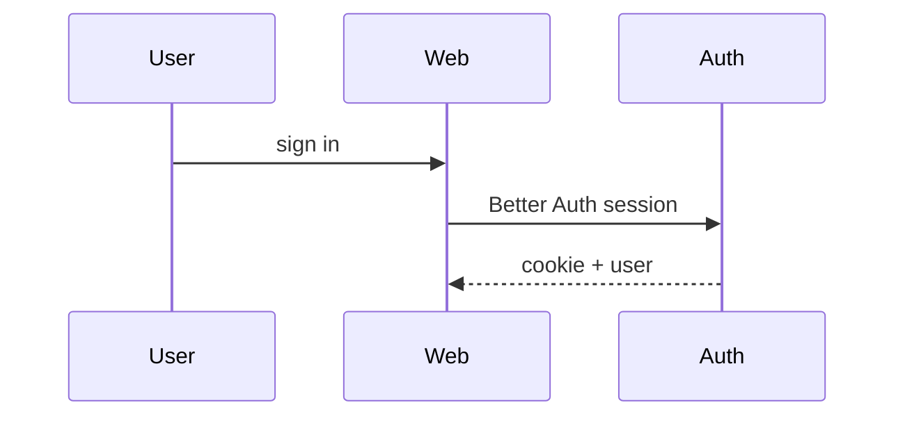

# Show Me

Help the user understand the current topic of conversation visually. Skip the preamble and keep prose brief. Pick the smallest view that makes the key point clear.

Adapted from [humanlayer/skills `show-me`](https://github.com/humanlayer/skills/tree/main/plugins/show-me/skills/show-me) for this monorepo (`apps/web`, `apps/mobile`, `packages/*`).

## Instructions

- Show logic or an algorithm as pseudocode:

```text
on(save)
  if content is unchanged
    return cached result
  write new content
  return fresh result
```

- Show runtime control flow as a call tree:

```text
submitForm
  createSession
    persistPrompt
    launchAgent
  navigateToSession
```

- Show UI structure as a component tree, including state and module boundaries that matter:

```tsx
<HomePage> (apps/web/src/app/(authenticated)/home/page.tsx)
  useSession()
  <AppShell>
    <ListeningActivity> (packages/scilent-ui)
```

- Show file responsibility or a broad refactor as a shallow file tree:

```text
apps/web/src/
├── app/              # App Router pages + route handlers
├── components/       # web-only UI
└── lib/              # client helpers, registries
packages/
├── ui/               # shared primitives + tokens
└── scilent-ui/       # app-specific UI layer
```

- Show component interaction, control flow, or data flow with Mermaid:



- Use `diff` when the point is what changes and the surrounding shape already exists. Match the diff shape to the topic.

For a component change:

```diff
 <HomePage>
   useSession()
   <AppShell>
+    <ListeningActivity />
   <Feed>
+    <ActivityCard />
```

For a file-layout change:

```diff
 packages/
 ├── ui/
+│   └── src/motion/     # shared ease/duration tokens
 ├── scilent-ui/
-└── auth.ts
+└── auth/
+    ├── client.ts
+    └── session.ts
```

For a call-tree or call-stack change:

```diff
 submitProfile
   validateForm
     persistProfile
+    invalidateCache
   navigateToHome
-  toastSuccess
+  toastSuccess
+    trackEvent
```

For a state or control-flow change:

```diff
 on(save)
-  write content
+  if content is unchanged
+    return cached result
+  write new content
+  invalidate cache
```

- Show the whole block when most of it is new, when omitted context would hide ownership or order, or when the user needs a copyable target shape:

```ts
function expandSkill(command: string): string {
  const skillName = command.slice(1);
  return `use the ${skillName} skill`;
}
```

- For a visual UI, layout, state comparison, or concept too dense for Mermaid, write **one** focused HTML file — a diagram, an infographic, or a short slide deck, whichever fits the point. Match this product's colors, type, spacing, and components (prefer tokens from `packages/ui/src/globals.css`); use real labels and data; support desktop and mobile. Then surface it for the user:

  - Prefer `$TMPDIR/show-me-{description}.html` (fall back to `/tmp/...`) for local sessions; open with `xdg-open` / `open` when a desktop is available.
  - On Cursor Cloud, write under `/opt/cursor/artifacts/show-me-{description}.html` and reference it with an HTML `<iframe>` or link in the reply (follow `walkthrough-artifacts` when producing demo media).
  - Do **not** commit these HTML files unless the user explicitly asks.

### Guidance

Place each visual next to the short text it supports. Keep only the calls, files, props, states, and boundaries needed to answer the user's current question or the options to resolve the current discussion point.

You may use one of these, you may use several; it is unlikely you will use all of them. Use your judgement and don't overwhelm the user.

## Additional resources

- Worked invoke examples: [examples.md](examples.md)
- Upstream skill: https://www.skills.sh/humanlayer/skills/show-me
